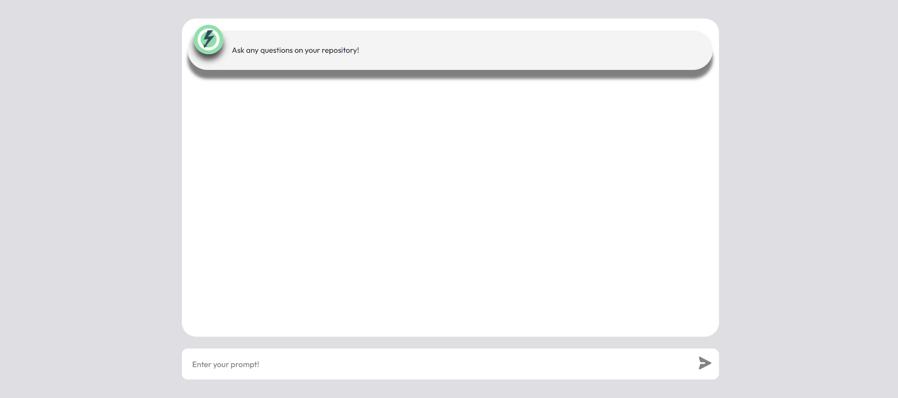
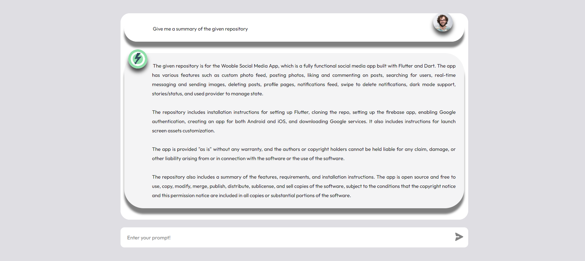

# GitInsight

## Overview
**GitInsight** is a powerful tool designed to interact with GitHub repositories, enabling the extraction, analysis, and querying of code through an intuitive chat interface. The frontend is built with React.js, while the backend leverages advanced language models and vector-based retrieval mechanisms to provide a seamless exploration of complex codebases.

## Features
- **Chat Interface**: Interact with GitHub repositories through a user-friendly chat interface.
- **Code Analysis**: Extract and analyze code using cutting-edge language models.
- **Querying Capabilities**: Seamlessly query codebases to gain insights and retrieve specific information.
- **Vector-Based Retrieval**: Utilizes FAISS for efficient document storage and retrieval.

## Technologies Used
- **React.js**: Frontend development.
- **GitHub API**: Access and interact with GitHub repositories.
- **LangChain**: Document loading, text splitting, and embedding.
- **FAISS**: Vector-based storage and retrieval.
- **ChatGroq**: Large Language Model.
- **Flask**: Backend API development.
- **Python**: Core programming language.
- **dotenv**: Environment variable management.

